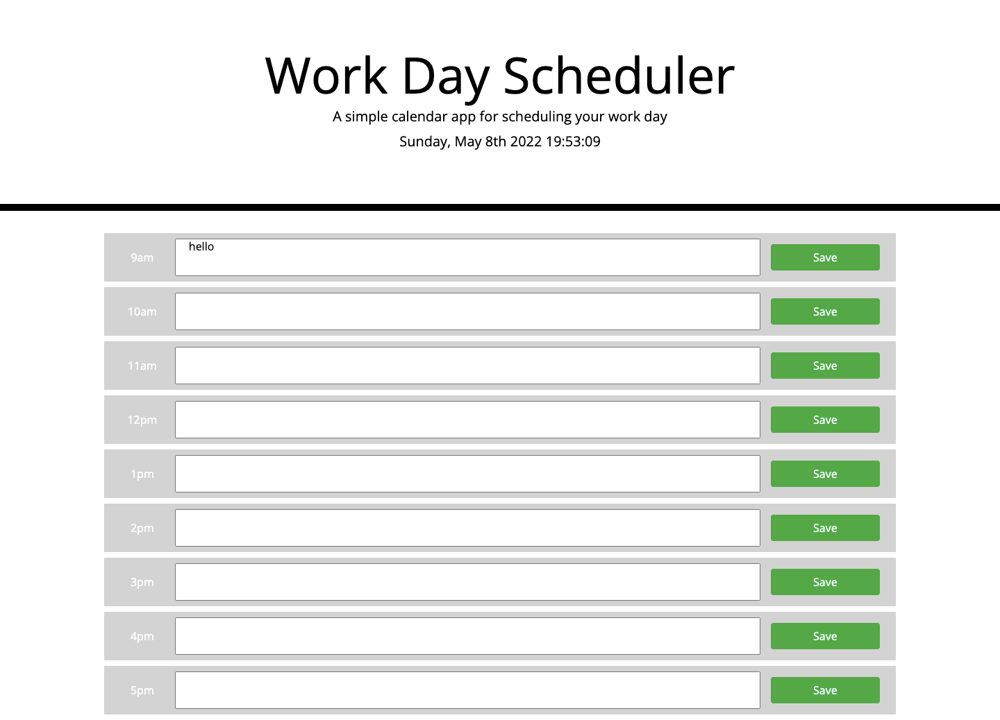

# work-day-scheduler

An application where the user can view their daily tasks delete old tasks for the working hours of 9am-5pm. The user can save (persistant data) and edit tasks.

The timeBlocks are color coded where red is present, green is the future and grey is the past.

# Languages / Frameworks / Libraries Used

I have used HTML, CSS , JavaScript , Jquery , MomentJs and Bootstrap.
One timeBlock was initially created in HTML and styled with Bootstrap and then transferred to JavaScript to be rendered dynamically using Jquery and template literals.
The time was used from MomentJs and formatted to display current time using the targetted ID in the HTML.

# Link to URL

Click the link to visit the website [here](https://roxywasiak.github.io/work-day-scheduler/)

# Screenshots

